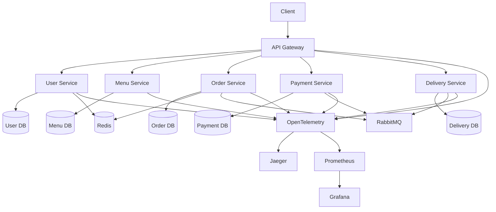
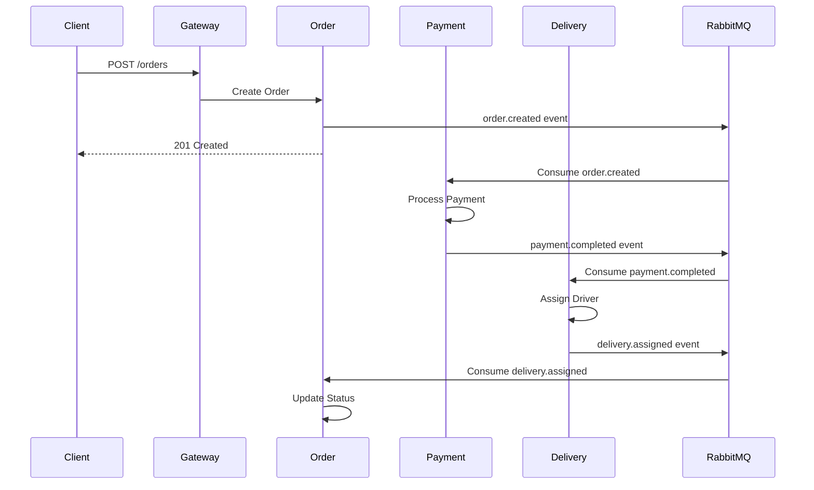
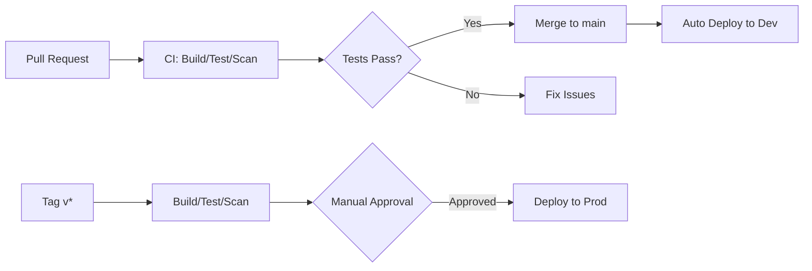

# Food App Microservices

A production-ready microservices system for a food delivery application, demonstrating Dev→Prod parity, modern observability, and cloud-native best practices.

## 🎯 Project Goals

- **Production-minded architecture**: Full observability, security scanning, proper resource management
- **Dev→Prod parity**: Identical services in development and production with environment-specific overlays
- **Event-driven design**: Async communication via RabbitMQ for order processing pipeline
- **Modern stack**: FastAPI, PostgreSQL, Redis, RabbitMQ, Kubernetes, OpenTelemetry
- **Automation-first**: CI/CD pipelines for building, testing, scanning, and deploying

## 🏗️ Architecture

### Services

- **api-gateway**: Ingress routing, rate limiting, shared error handling, OIDC-ready
- **user-service**: User signup, login, profile management
- **menu-service**: Restaurant and menu item CRUD operations
- **order-service**: Order creation and state management (Pending → Paid → Assigned → Delivered)
- **payment-service**: Mock payment capture and settlement (idempotent)
- **delivery-service**: Driver assignment and delivery status tracking

### Technology Stack

- **Language/Framework**: FastAPI (Python)
- **Databases**: PostgreSQL (per service), Redis (cache/session)
- **Messaging**: RabbitMQ for event-driven communication
- **Containers**: Docker with GHCR registry
- **Orchestration**: Docker Compose (local), Kubernetes (dev/prod)
- **Observability**: OpenTelemetry → Jaeger (traces), Prometheus + Grafana (metrics)
- **Security**: Trivy image scanning, Dependabot, secrets management
- **CI/CD**: GitHub Actions with automated dev and gated prod deployments

### System Diagram



### Order Flow Sequence



### CI/CD Pipeline



## 🚀 Quickstart

### Local Development (Docker Compose)

```bash
# Start all services with infrastructure (Postgres, Redis, RabbitMQ, Jaeger, Prometheus, Grafana)
docker compose --profile dev up

# View logs
docker compose logs -f

# Access services
# - API Gateway: http://localhost:8000
# - Jaeger UI: http://localhost:16686
# - Grafana: http://localhost:3000
# - Prometheus: http://localhost:9090

# Stop services
docker compose down
```

### Kubernetes Development Deployment

```bash
# Build and push images (optional, can use pre-built)
make build-all

# Deploy to local Kubernetes (k3d/minikube)
kustomize build platform/k8s/overlays/dev | kubectl apply -f -

# Check deployment status
kubectl get pods -n foodapp-dev

# Port forward API Gateway
kubectl port-forward -n foodapp-dev svc/api-gateway 8000:80

# View logs
kubectl logs -n foodapp-dev -l app=order-service -f
```

### Kubernetes Production Deployment

```bash
# Tag a release
git tag -a v1.0.0 -m "Release v1.0.0"
git push origin v1.0.0

# GitHub Actions will:
# 1. Build and scan images
# 2. Wait for manual approval
# 3. Deploy to production with:
#    - TLS via cert-manager
#    - Horizontal Pod Autoscaling
#    - Pod Disruption Budgets
#    - External databases/message queues

# After approval, verify deployment
kubectl get pods -n foodapp-prod
kubectl get ingress -n foodapp-prod
```

## 📁 Repository Layout

```
/apps/                          # Application services
  api-gateway/                  # API Gateway service
  user-service/                 # User management service
  menu-service/                 # Menu CRUD service
  order-service/                # Order processing service
  payment-service/              # Payment handling service
  delivery-service/             # Delivery management service

/platform/                      # Infrastructure and deployment
  docker/                       # Base Dockerfiles and .dockerignore
  compose/                      # Docker Compose configurations
  k8s/                          # Kubernetes manifests
    base/                       # Base K8s resources
    services/                   # Per-service K8s objects
    overlays/
      dev/                      # Development overlay
      prod/                     # Production overlay
  grafana/                      # Grafana dashboards
  prometheus/                   # Prometheus configurations
  otel/                         # OpenTelemetry collector config
  jaeger/                       # Jaeger manifests

/docs/                          # Documentation
  00-architecture.md            # Architecture documentation
  01-local-dev.md              # Local development guide
  02-k8s-dev-deploy.md         # Kubernetes dev deployment
  03-ci-cd.md                  # CI/CD pipeline documentation
  04-prod-deploy.md            # Production deployment guide
  transcript.md                # Development transcript

/.github/workflows/             # CI/CD pipelines
  ci.yml                        # PR build, test, and scan
  cd-dev.yml                    # Automated dev deployment
  cd-prod.yml                   # Gated production deployment
```

## 🔧 Configuration

### Environment Variables

Variables are defined in:
- **Development**: `.env` files and `docker-compose.dev.yml`
- **Production**: Kubernetes Secrets and ConfigMaps

Key variables:
- `ORG/OWNER`: Dhananjaiah (GitHub organization/user)
- `REPO_NAME`: microservices
- `GHCR_REGISTRY`: ghcr.io/dhananjaiah
- `DEV_DOMAIN`: foodapp.localtest.me
- `PROD_DOMAIN`: foodapp.example.com
- `K8S_INGRESS_CLASS`: nginx
- `DOCKER_COMPOSE_PROFILE`: dev

## 🧪 Testing

```bash
# Run all tests
make test

# Run tests for a specific service
cd apps/menu-service
pytest

# Run integration tests
make test-integration

# Lint and type check
make lint
```

## 🔒 Security

- **Image Scanning**: Trivy scans all images for vulnerabilities (fails on High/Critical by default)
- **Dependency Updates**: Dependabot monitors Python, Docker, and GitHub Actions dependencies
- **Secrets Management**: No secrets in code; environment-based configuration
- **TLS**: Let's Encrypt certificates in production via cert-manager
- **Network Policies**: Kubernetes network policies for pod-to-pod communication

## 📊 Observability

### Tracing
- OpenTelemetry auto-instrumentation for HTTP and database calls
- Jaeger UI for distributed tracing visualization
- Cross-service trace correlation

### Metrics
- Prometheus scraping via ServiceMonitor/PodMonitor
- Custom business metrics (orders/sec, payment success rate, etc.)
- Pre-built Grafana dashboards

### Logging
- Structured JSON logging
- Compatible with Loki aggregation
- Correlation IDs for request tracing

## 🛠️ Development Commands

```bash
# Build all services
make build-all

# Start development environment
make up

# Run tests
make test

# Deploy to dev Kubernetes
make k8s-dev

# Tag and prepare for production release
make tag v=1.0.0

# View logs in development
make logs

# Clean up
make clean
```

## 📝 Documentation

See `/docs` directory for detailed documentation:
- [Architecture](docs/00-architecture.md)
- [Local Development](docs/01-local-dev.md)
- [Kubernetes Dev Deployment](docs/02-k8s-dev-deploy.md)
- [CI/CD](docs/03-ci-cd.md)
- [Production Deployment](docs/04-prod-deploy.md)
- [Development Transcript](docs/transcript.md)

## 🤝 Contributing

1. Fork the repository
2. Create a feature branch
3. Make changes with tests
4. Run linters and tests
5. Submit a pull request

CI will automatically build, test, and scan your changes.

## 📄 License

This project is licensed under the MIT License - see the [LICENSE](LICENSE) file for details.

## 🙏 Acknowledgments

Built with modern cloud-native best practices, inspired by production microservices architectures.
