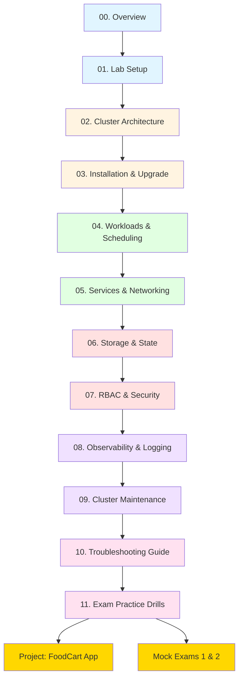

# CKA Kubernetes Course — Overview

## 🎯 Goals

- **Pass the CKA exam** with confidence by mastering all exam domains through hands-on practice
- **Build production-ready Kubernetes skills** for real-world cluster administration and troubleshooting
- **Learn by doing** with copy-pasteable commands, mini-labs, and a complete end-to-end project

## 👥 Audience

This course is designed for:
- System administrators and DevOps engineers preparing for the CKA exam
- Kubernetes practitioners who want to deepen their cluster administration skills
- Anyone who needs to install, configure, maintain, and troubleshoot Kubernetes clusters

**Prerequisites:**
- Basic Linux command line skills (cd, ls, grep, systemctl)
- Understanding of containers (Docker or similar)
- Familiarity with YAML syntax
- Access to VMs or cloud resources for practice

## 🛠️ How to Practice

### Option 1: Local VMs (Recommended for Learning)
- **Hypervisor**: VirtualBox, KVM/QEMU, VMware Workstation
- **Nodes**: 1 control-plane + 2 workers minimum (3 control-plane + 3 workers for HA practice)
- **Resources per node**: 2 vCPU, 2-4 GB RAM, 20 GB disk
- **OS**: Ubuntu 22.04 LTS or Rocky Linux 9

### Option 2: Cloud (Good for Quick Setup)
- **AWS**: EC2 instances (t3.medium or larger)
- **GCP**: Compute Engine instances (e2-medium or larger)
- **Azure**: Standard B2s instances or larger
- **Cost**: ~$20-50/month if you tear down after practice

### Option 3: Managed Kubernetes for Verification Only
- **GKE**, **EKS**, **AKS** can be used to verify concepts
- **Warning**: CKA tests kubeadm-based clusters, so practice with kubeadm!

## ✅ How to Verify Tasks

Every module follows the **Commands → Verify → Understand** pattern:

1. **Run commands** (copy-paste from fenced blocks)
2. **Verify success** with specific kubectl/system commands
3. **Understand why** through short explanations

Common verification commands used throughout:
```bash
kubectl get <resource> -A
kubectl describe <resource> <name> -n <namespace>
kubectl logs -n <namespace> <pod> [-c <container>]
kubectl auth can-i <verb> <resource> --as <user> -n <namespace>
```

## 📚 Course Map



## 📖 Course Modules

### Foundation (Modules 00-03)
**Time**: ~6-8 hours  
**Focus**: Understand Kubernetes architecture and get a working cluster

- **Module 00**: Overview (this document)
- **Module 01**: Lab Setup — Ubuntu & RHEL installation, kubeadm cluster init
- **Module 02**: Cluster Architecture — API server, etcd, scheduler, controllers
- **Module 03**: Installation & Upgrade — kubeadm workflow, version upgrades

### Core Operations (Modules 04-06)
**Time**: ~10-12 hours  
**Focus**: Deploy and manage workloads, networking, and storage

- **Module 04**: Workloads & Scheduling — Pods, Deployments, Jobs, affinities, taints
- **Module 05**: Services & Networking — ClusterIP, NodePort, Ingress, NetworkPolicies
- **Module 06**: Storage & State — PV, PVC, StorageClasses, StatefulSets

### Security & Operations (Modules 07-09)
**Time**: ~8-10 hours  
**Focus**: Secure the cluster and maintain it

- **Module 07**: RBAC & Security — Roles, RoleBindings, ServiceAccounts, Pod Security
- **Module 08**: Observability & Logging — Metrics, logs, events, troubleshooting tools
- **Module 09**: Cluster Maintenance — Drain, backup/restore etcd, certificate rotation

### Mastery (Modules 10-11)
**Time**: ~6-8 hours  
**Focus**: Troubleshoot any issue and practice exam scenarios

- **Module 10**: Troubleshooting Guide — Systematic debugging of common failures
- **Module 11**: Exam Practice Drills — Timed tasks mimicking real exam questions

### Project & Exams
**Time**: ~8-10 hours  
**Focus**: Apply everything end-to-end

- **FoodCart Project**: Deploy microservices with proper security, storage, networking
- **Mock Exam 1**: 15 tasks, 2 hours, cluster failures and recovery
- **Mock Exam 2**: 15 tasks, 2 hours, mixed operations and troubleshooting

## 🎓 Exam Tips

### CKA Exam Format (2024)
- **Duration**: 2 hours
- **Questions**: 15-20 performance-based tasks
- **Passing Score**: 66%
- **Environment**: kubectl, vi/vim/nano, browser for docs
- **Allowed Resources**: kubernetes.io/docs, github.com/kubernetes, kubernetes.io/blog

### Success Strategy
1. **Speed**: Practice typing kubectl commands without autocomplete at first
2. **Bookmarks**: Pre-bookmark common pages (RBAC, NetworkPolicy, PV/PVC)
3. **Time Management**: Skip hard questions, come back later
4. **Verification**: Always verify your work with `kubectl get/describe`
5. **Imperative First**: Use `kubectl create/run` with `--dry-run=client -o yaml` when possible

### Common Pitfalls to Avoid
- Not reading the question carefully (check namespace, context!)
- Forgetting to switch context between clusters
- Spending too long on one question
- Not verifying your changes took effect
- Using deprecated API versions

## 📅 Study Schedule Recommendations

### Intensive (2-3 weeks)
- **Week 1**: Modules 01-06 + daily labs
- **Week 2**: Modules 07-09 + FoodCart project
- **Week 3**: Modules 10-11 + mock exams (repeat until 90%+)

### Standard (4-6 weeks)
- **Weeks 1-2**: Modules 01-04, one module every 3-4 days
- **Weeks 3-4**: Modules 05-08, include FoodCart project
- **Weeks 5-6**: Modules 09-11, focus on troubleshooting and mock exams

### Relaxed (8-12 weeks)
- **One module per week** for Modules 01-09
- **Two weeks** for troubleshooting and drills (Modules 10-11)
- **Two weeks** for project and mock exams

## 🔧 Default Configuration

This course uses the following defaults (stated explicitly when they matter):

- **Kubernetes Version**: 1.28+ (stable release)
- **CRI**: containerd (with SystemdCgroup=true)
- **CNI**: Calico (for dev/practice)
- **Cluster Tool**: kubeadm
- **OS**: Ubuntu 22.04 LTS (with RHEL/Rocky 9 variants shown)
- **Cluster Size**: 1 control-plane + 2 workers (HA examples use 3+3)

## 📂 Repository Structure

```
/course/
  ├── 00-overview.md (this file)
  ├── 01-lab-setup.md
  ├── 02-cluster-architecture.md
  ├── 03-installation-and-upgrade.md
  ├── 04-workloads-and-scheduling.md
  ├── 05-services-and-networking.md
  ├── 06-storage-and-state.md
  ├── 07-rbac-and-security.md
  ├── 08-observability-and-logging.md
  ├── 09-cluster-maintenance.md
  ├── 10-troubleshooting-guide.md
  └── 11-exam-practice-drills.md

/project/
  ├── README.md                    # FoodCart app overview
  ├── manifests/                   # All K8s YAML files
  │   ├── 00-namespace.yaml
  │   ├── 01-postgres-pv.yaml
  │   ├── 02-postgres.yaml
  │   ├── 03-menu-service.yaml
  │   ├── 04-orders-service.yaml
  │   ├── 05-payments-service.yaml
  │   ├── 06-api-gateway.yaml
  │   ├── 07-frontend.yaml
  │   ├── 08-ingress.yaml
  │   ├── 09-hpa.yaml
  │   ├── 10-pdb.yaml
  │   └── 11-network-policies.yaml
  ├── scripts/
  │   ├── seed-data.sh
  │   ├── load-test.sh
  │   └── chaos-inject.sh
  └── runbook.md                   # SRE troubleshooting playbook

/cheatsheets/
  ├── kubectl-cheatsheet.md
  ├── yaml-snippets.md
  └── troubleshooting-checklist.md

/exams/
  ├── mock-exam-1.md
  ├── mock-exam-1-solutions.md
  ├── mock-exam-2.md
  └── mock-exam-2-solutions.md
```

## 🚀 Getting Started

1. **Read this overview** to understand the course structure
2. **Set up your lab environment** using Module 01
3. **Work through modules sequentially** — each builds on the previous
4. **Complete all mini-labs** in each module
5. **Build the FoodCart project** after Module 09
6. **Take mock exams** and review mistakes
7. **Schedule your CKA exam** when you consistently score 90%+ on mocks

## 💡 Learning Tips

- **Type commands manually** instead of copy-pasting (builds muscle memory)
- **Break things intentionally** and practice fixing them
- **Use `kubectl explain`** to understand resource fields
- **Read error messages carefully** — they often tell you exactly what's wrong
- **Keep notes** of commands you forget frequently
- **Join communities** — Kubernetes Slack, Reddit r/kubernetes, CNCF forums

## ⚡ Quick Reference

### Essential Commands
```bash
# Context switching (exam critical!)
kubectl config get-contexts
kubectl config use-context <context-name>

# Fast resource creation
kubectl run nginx --image=nginx --dry-run=client -o yaml
kubectl create deployment web --image=nginx --dry-run=client -o yaml

# Quick debugging
kubectl get events -A --sort-by='.lastTimestamp'
kubectl logs <pod> -n <namespace> --previous
kubectl describe pod <pod> -n <namespace>

# Imperative edits
kubectl set image deployment/web nginx=nginx:1.21
kubectl scale deployment/web --replicas=5
kubectl expose deployment/web --port=80 --target-port=80
```

### Time-Saving Aliases
```bash
alias k='kubectl'
alias kgp='kubectl get pods'
alias kgpa='kubectl get pods -A'
alias kdp='kubectl describe pod'
alias kl='kubectl logs'
alias kex='kubectl exec -it'
```

Add these to `~/.bashrc` on your lab machines.

## 🆘 Need Help?

- **Stuck on a concept?** Re-read the module and try the mini-lab again
- **Commands not working?** Check the "Common Mistakes" section in each module
- **Exam-specific questions?** Review Module 11 (Exam Practice Drills)
- **Real-world scenarios?** Work through the FoodCart project

---

**Ready to become a Kubernetes expert? Let's start with Module 01 — Lab Setup!** 🚀
