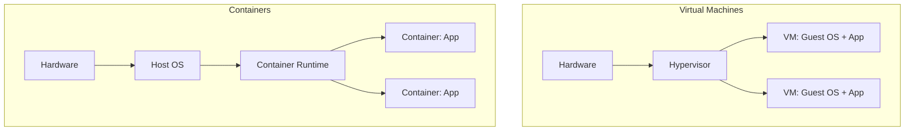

# Containers and Virtual Machines

Containers share the host OS kernel and virtualize at the OS level, while VMs include a full OS and virtualize at the hardware level. Containers are more lightweight but VMs provide stronger isolation.

## Architecture Comparison

## Key Differences

- **Startup Time**: Containers (seconds) vs VMs (minutes)
- **Size**: Containers (MBs) vs VMs (GBs)
- **Isolation**: Containers (process-level) vs VMs (hardware-level)
- **Overhead**: Containers (minimal) vs VMs (full OS)

## Labs

- [Lab 01: Compare Container vs VM Characteristics](labs/lab-01.md)
