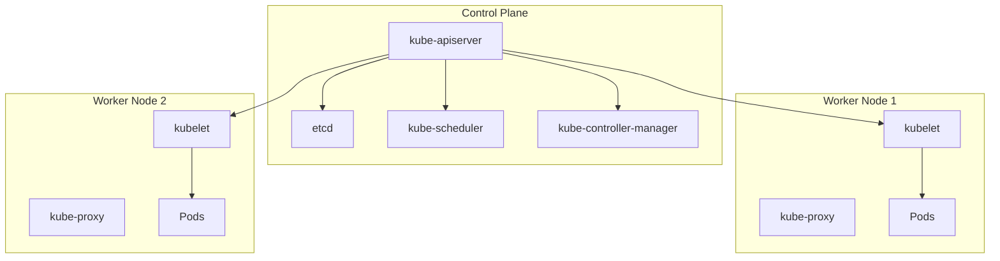

# Kubernetes Architecture

Kubernetes has a master-worker architecture with a control plane managing worker nodes. The control plane makes global decisions, while nodes run containerized applications.

## Control Plane Components

- **kube-apiserver**: Frontend for Kubernetes control plane
- **etcd**: Distributed key-value store for cluster data
- **kube-scheduler**: Assigns pods to nodes
- **kube-controller-manager**: Runs controller processes
- **cloud-controller-manager**: Integrates with cloud providers

## Node Components

- **kubelet**: Agent ensuring containers run in pods
- **kube-proxy**: Network proxy on each node
- **Container Runtime**: Runs containers (Docker, containerd, CRI-O)

## Architecture Diagram

## Labs

- [Lab 01: Explore Cluster Components](labs/lab-01.md)
